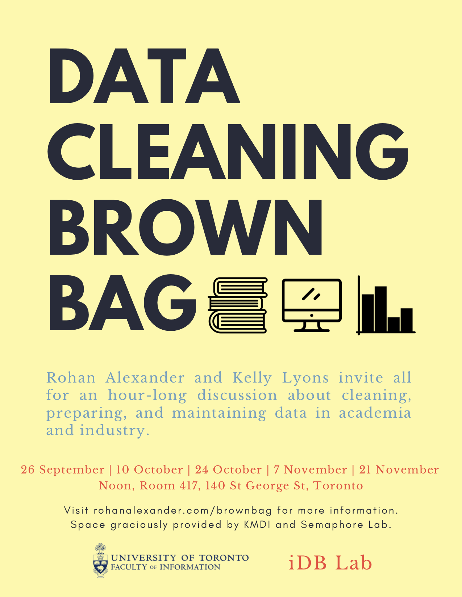

```{r setup, include=FALSE}
knitr::opts_chunk$set(echo = FALSE)
```

*An hour-long discussion about cleaning, preparing, and maintaining data in academia and industry. All welcome! If you would like to receive emails about the series please [get in touch](mailto:rohan.alexander@utoronto.ca).*

**Overview**

In any data science project a lot of time is spent on data cleaning, preparation, and maintenance, but these steps are rarely talked about, let alone written down. This means that there is a lot of reinvention and it can be difficult to know what best practice is. To help address this [Rohan Alexander](https://rohanalexander.com/) and [Prof Kelly Lyons](http://individual.utoronto.ca/klyons/) run a multidisciplinary brown bag that focuses on data cleaning. The series is a chance to share what we do in these crucial, yet little discussed, stages.

We meet for an hour roughly every two weeks and we aim to have a roughly even split of speakers from academia and industry over the course of the semester. Usually each speaker talks for 15 to 25 minutes and we then have a bit of time for questions.

Anyone is welcome to attend - you don't need to be affiliated with the university. 

**Schedule**  
 
* *Noon, Thursday, 26 September 2019*  
    [Prof Periklis Andritsos](http://www.cs.toronto.edu/~periklis/) (ODAIA & U of T, iSchool)  
* *Noon, Thursday, 10 October 2019*  
    [Dr Hassan Teimoori](https://ca.linkedin.com/in/hassan-teimoori) (Deloitte, Omnia AI)  
    [Prof Ludovic Rheault](https://ludovicrheault.weebly.com/) (U of T, Political Science)
* *Noon, Wednesday, 16 October 2019*  
    [Dr Lauren Kennedy](https://au.linkedin.com/in/lauren-kennedy-783864bb) (Columbia University)  
    Special hands-on data wrangling meeting - bring your laptop!
* *Noon, Thursday, 24 October 2019*  
    [Sharla Gelfand](https://sharla.party/) (Freelance R and Shiny developer)  
* *Noon, Thursday, 7 November 2019*  
    [Dr Maria D'Angelo](https://ca.linkedin.com/in/mariacdangelo) (Delphia)  
    [Hareem Naveed](https://ca.linkedin.com/in/hareemnaveed) (Munich Re)    
* *Noon, Thursday, 21 November 2019*  
    [Prof Michelle Alexopoulos](http://homes.chass.utoronto.ca/~malex/) (U of T, Economics)  
    [Paraskevi Massara](https://ca.linkedin.com/in/paraskevi-massara-597326a0) (U of T, Medicine)  

**Location and time**  
We meet at noon, in Room 417, 140 St George St, Toronto (space graciously provided by [KMDI and Semaphore Lab](http://kmdi.utoronto.ca/tag/semaphore/)).

If you would like to receive an occasional email about the series please [get in touch](mailto:rohan.alexander@utoronto.ca). 

<!--  -->