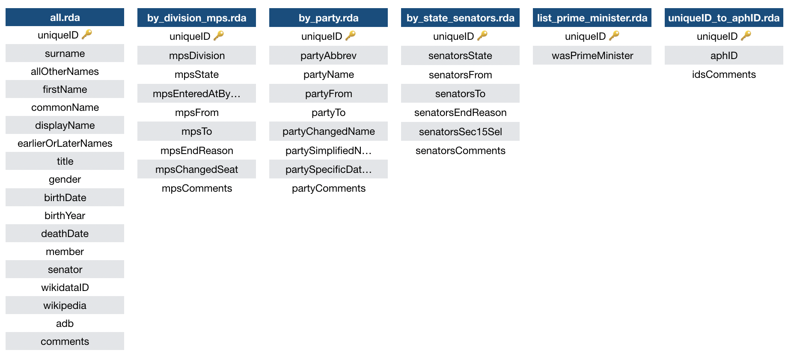

```{r setup, include=FALSE}
knitr::opts_chunk$set(echo = FALSE)
```


```{r  out.width = "30%"}
knitr::include_graphics("images/AustralianPoliticians.png") 
```
`AustralianPoliticians` is an R package that consists of a collection of datasets related to Australian politicians.

The datasets are:

* **all.rda**: The main dataset. 
* **by_division_mps.rda**: Adds information about the division ('seat') of the politician. 
* **by_party.rda**: Adds information about the party of the politician. 
* **by_state_senators.rda**: Adds information about the state that a senator was representing.
* **list_prime_ministers.rda**: Whether the politician was prime minister. 
* **uniqueID_to_aphID.rda**: A correspondence between the uniqueIDs used in these datasets and the IDs used by the Australian Parliament House.



The datasets are up-to-date as of 1 September 2019 (i.e. they include the deaths of Tim Fisher and Elaine Darling). You can install the pacakge from GitHub, and more information is available [there](https://github.com/RohanAlexander/AustralianPoliticians).
